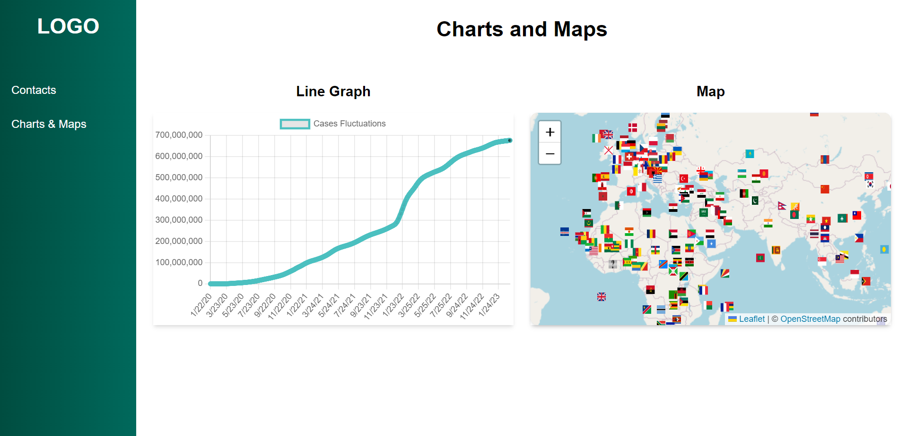
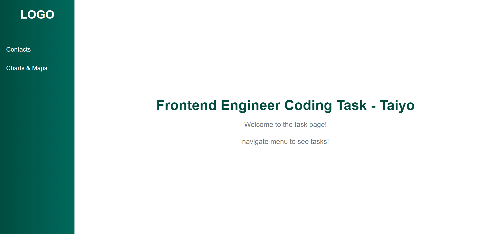

# Running the App

view the live demo of the app [here](<https://frontend-task-green.vercel.app/>).

## Prerequisites
Make sure you have Node.js and npm installed on your machine.

## Installation
1. Clone the repository to your local machine.

2. Navigate to the project directory in your terminal.

3. Run the command `npm install` to install the dependencies.

## Running the App
1. After installing the dependencies, run the command `npm start`.
###npm start

2. Open your browser and navigate to [http://localhost:3000](http://localhost:3000) to view the app.

You can also view a live demo of the app [here](<https://frontend-task-green.vercel.app/>).

## API Endpoints Used
- **Worldwide Data of Cases**: [https://disease.sh/v3/covid-19/all](https://disease.sh/v3/covid-19/all)
- **Country Specific Data of Cases**: [https://disease.sh/v3/covid-19/countries](https://disease.sh/v3/covid-19/countries)
- **Graph Data for Cases with Date**: [https://disease.sh/v3/covid-19/historical/all?lastdays=all](https://disease.sh/v3/covid-19/historical/all?lastdays=all)

# Screenshots
### Desktop view
   
   

### Mobile view
      

